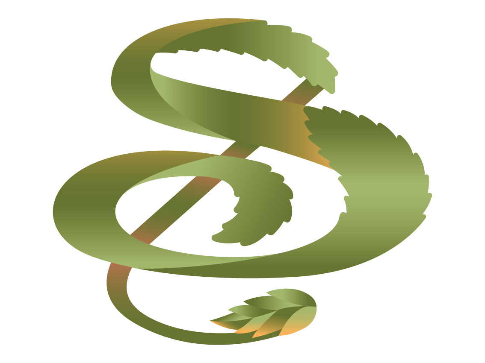
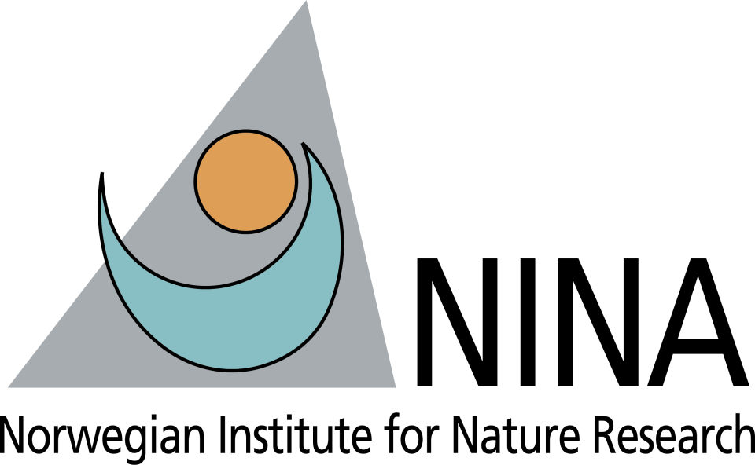

# SONATA Spatial Tool Demonstration Repository

## Overview
This is a temporary repository for __demonstrating the SONATA spatial tool__ that is being developed in the frame of the HEU [__SONATA__](https://sonata-nbs.com/) project. The included notebook, test data and scripts illustrate the workings of the tool and allow performing small experiments with it.

Please note that the tool included here is still in an __experimental stage__ of development and is not yet deemed suitable for operational use. The code examples shown may not be representative for how the spatial tool will work once published.

Also note that the included source code is only a __partial and static copy of the original source code__. The full code base reflecting the current and previous versions of the SONATA spatial tool is hosted on the (not yet published) repository dedicated to this purpose.

## License
The software included in this repository falls under an "__all rights reserved__" license. Consult the [__LICENSE__](LICENSE) included in this repository for more info.

## How to use
Click on the "launch binder" badge below to open the Binder project linked to this repository in your browser. The Binder project may take a few minutes to fully load, so please be patient. Once loaded, open the notebook called 'demo.ipybn' and follow the provided instructions.

## Contact & info
Questions regarding the use of the SONATA spatial tool or this demonstration repository can be
directed to [frederik.priem@vito.be](frederik.priem@vito.be).

## Acknowledgements
While VITO is taking a leading role in the development of the SONATA spatial tool, we would like to acknowledge the valuable contributions made to this effort by several of the SONATA consortium partners. The people we would like to thank include, but are not limited to:

- BioSense Institute:
    - Nikola Obrenović
    - Maksim Lalić
    - Tijana Nikolic
    - Maja Knežević
    - Branislav Pejak
- Norwegian Institute for Nature Research
    - Markus Sydenham
    - Hedda Ørbæk

We would furthermore like to acknowledge the funding received from the European Commission for the SONATA project.

  
  
  

